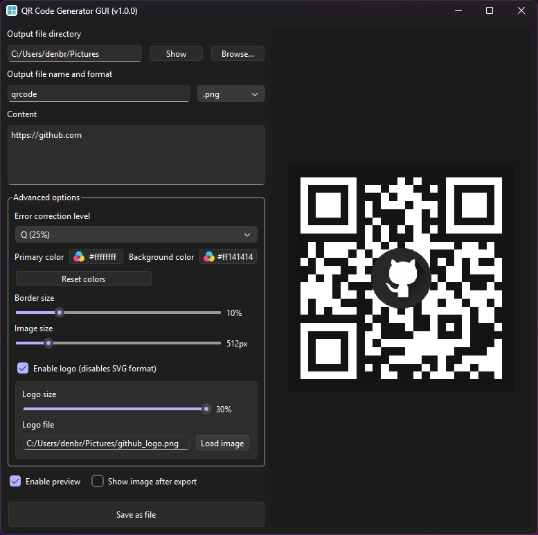

# QR Code Generator GUI
A small GUI application for generating and styling QR code images

## Appearance

## Prerequisites
* C/C++ compiler
* CMake
* Qt 6 Widgets
* Qt 6 Svg
* Nayuki's QR Code generator library (included in the source code)
